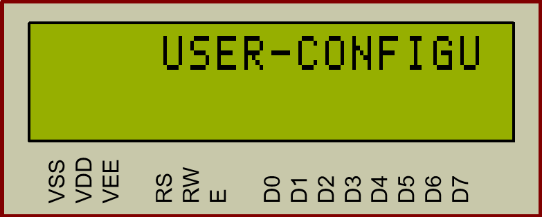
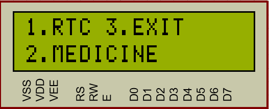
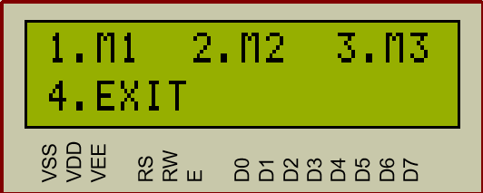
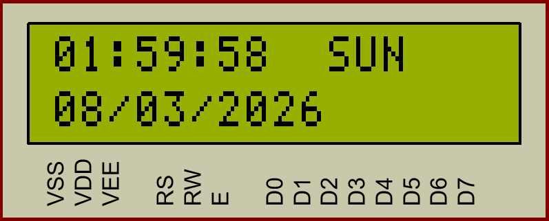
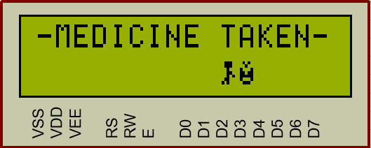
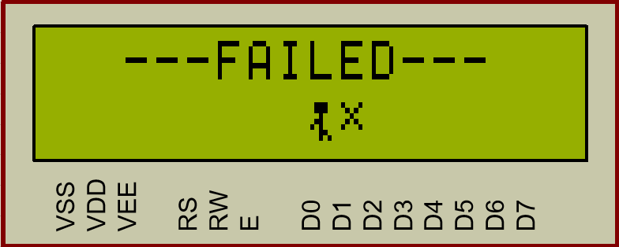
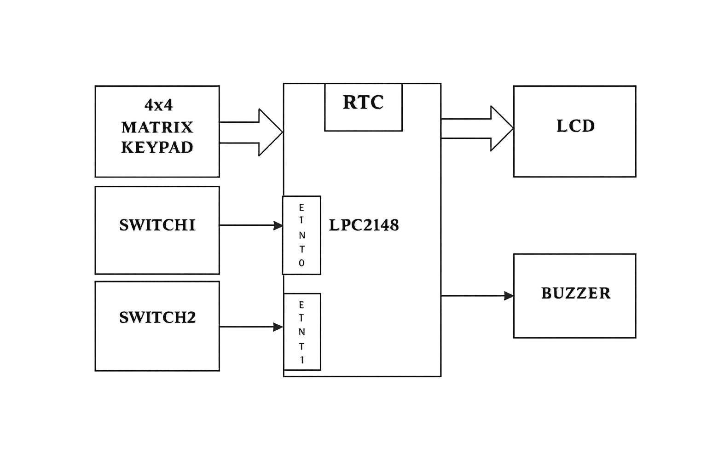
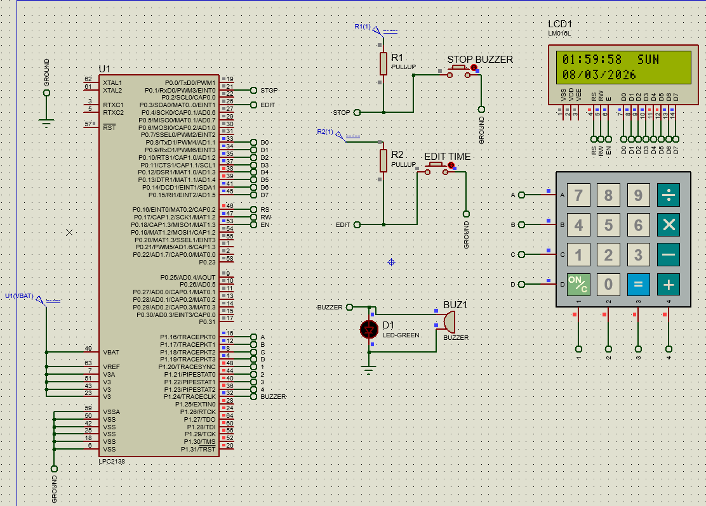

# 💊 USER CONFIGURABLE MEDICINE REMINDER SYSTEM

  

> 📟 The above display shows a scrolling message:  
> **"USER CONFIGURABLE MEDICINE REMINDER SYSTEM"**

An embedded system using LPC2148 that provides real-time medicine reminders with interrupt-based control, LCD interface, and buzzer alerts for reliable and user-friendly operation.

---

## 📌 Project Overview

The User Configurable Medicine Reminder System is an embedded system built using the LPC2148 microcontroller and RTC to provide timely medicine alerts. It allows users to set and edit medicine schedules, and generates alerts using a buzzer and LCD display when the time matches.

---

## 🎯 Objectives

- 🕒 Display real-time date and time using RTC  
- ⚙️ Allow user to edit RTC time and medicine schedules  
- 🔄 Monitor medicine timings continuously  
- 🚨 Generate alerts when medicine time occurs  
- 🎛️ Provide interrupt-based user control  

---

## 🧠 Working Principle

### 1️⃣ Edit Mode (Switch-2 / EINT1) ⚙️

- 🔘 Press Switch-2 to enter configuration mode  
- ✏️ Edit RTC time and medicine schedule using keypad  

- 💾 Store data in controller memory  

---

### 2️⃣ Real-Time Monitoring ⏱️

- 🔄 Continuously read RTC time  
- 🔍 Compare with stored medicine timings  

---

### 3️⃣ Alert Generation 🚨

- ⬆️ If medicine is in front → move forward  

- ⬇️ If medicine is behind → move backward  

- 📺 LCD displays **"TIME FOR MEDICINE"**  
- 🔔 Buzzer turns ON (periodic alert)

---

### 4️⃣ Buzzer Control (Switch-1 / EINT0) 🔕

- 🔘 Press Switch-1 to stop the buzzer  
- ✅ Alert is cleared and system returns to normal mode  

---

### 5️⃣ Auto Stop ⏳

- ⏱️ Buzzer stops automatically after a fixed time if no action  

---

## 🧩 Block Diagram 🧱

<h2>Block Diagram</h2>

  

**Inputs:** RTC, Keypad, Switch-1, Switch-2  
**Controller:** LPC2148  
**Outputs:** LCD, Buzzer  

---

## 🔌 Circuit Diagram ⚡

<h2>Software Flow Diagram</h2>

  

---

## 🛠️ Hardware Requirements 🧰

- 🧠 LPC2148 Microcontroller  
- 📺 16×2 LCD  
- 🔢 4×4 Matrix Keypad  
- 🔔 Buzzer  
- 🔘 Push Buttons (Switch-1 & Switch-2)  
- 🕒 RTC Module  
- 🔌 USB-UART / DB9  

---

## 💻 Software Requirements 🧑‍💻

- Embedded C  
- Keil µVision  
- Flash Magic  

---

## ✨ Features

- 🕰️ Real-time clock display  
- ⚡ Interrupt-based control (EINT0 & EINT1)  
- ✏️ Editable time and schedule  
- ⏰ Medicine reminder alerts  
- 🔔 Buzzer notification system  
- ⚙️ Efficient real-time operation  
- 📺 LCD user interface  

---

## 🔑 Switch Functions 🔘

| Switch | Interrupt | Function |
|--------|----------|---------|
| 🔘 Switch-1 | EINT0 | 🔕 Stop buzzer (Alert OFF) |
| 🔘 Switch-2 | EINT1 | ⚙️ Enter edit/configuration mode |

---

## 🧭 User Guide 🧑‍⚕️

1. 🔌 Power ON → LCD shows current time  
2. 🔘 Press **Switch-2** → Enter edit mode  
3. ✏️ Set time and medicine schedule  
4. ⏳ Wait for alert  
5. 🔕 Press **Switch-1** → Stop buzzer  

---

## 💡 Future Enhancements 🚀

- 💊 Multiple medicine reminders  
- 💾 EEPROM/Flash storage  
- 📡 GSM module for SMS alerts  
- 📱 Mobile app integration (IoT)  
- 🔊 Voice alert system  
- 🔋 Low power optimization  

---

## 👨‍💻 Developed By

**Manikanta Karthik Pantham**

- 💻 Developed a Medicine Reminder System using LPC2148 ARM7 microcontroller with Embedded C  
- ⚙️ Implemented RTC monitoring, LCD interface, keypad input, and buzzer alerts  

---

## 📜 License

This project is for academic purposes. Free to modify with proper credit.

---

⭐ If you find this useful, give it a star!
